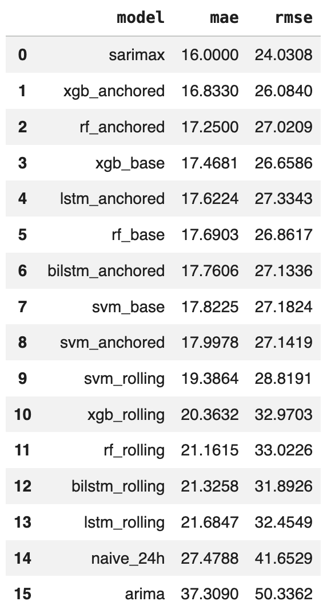
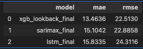

# Explaining Day-Ahead Electricity Price Forecasts in the German Market: A Comparative Model Evaluation

## Repository structure

```
.
├── eda.ipynb              Exploratory data analysis of the target and features
├── modelling.ipynb        Preprocessing, feature selection, model training, validation and testing
├── explainability.ipynb   TreeSHAP analysis of the final XGBoost model
├── data/
│   ├── ENTSOE/
│   │   ├── entsoe.ipynb                    downloads price and load forecast
│   │   └── entsoe_price_and_loadfc.parquet
│   ├── Marktstammdatenregister/
│   │   ├── power_units.ipynb               parses the plant registry
│   │   ├── power_wind.parquet
│   │   └── power_solar.parquet
│   ├── NOAA GFS/
│   │   ├── noaa_gfs.py                      downloads and aggregates GFS forecasts
│   │   ├── aggregate_weather_fc.ipynb       merges the daily files
│   │   └── weather_forecast.parquet
│   └── *.csv                                generated tuning results (gitignored)
├── models/
│   └── xgb_anchored_final.ubj               final model used for explainability
└── requirements.txt                         pinned Python dependencies
```

## Data pipeline

Three independent sources are prepared separately and then joined on an hourly
`Europe/Berlin` index in `modelling.ipynb`. All processing is DST-aware. The target and
features cover 2023 to 2025 for the bidding zone DE-LU (Germany/Luxembourg).

### ENTSO-E: price and load (`data/ENTSOE/entsoe.ipynb`)

Downloads the day-ahead price (`da_price`) and the day-ahead load forecast (`load_fc`)
from the ENTSO-E Transparency Platform via the `entsoe-py` API (API key read from
`data/api_keys.txt`). The two series arrive at different and changing granularities:
the load forecast is quarter-hourly throughout, and the price switches from hourly to
quarter-hourly. Both are resampled to a common hourly grid (price by mean,
load by mean), and missing timestamps are filled by linear interpolation. Output:
`entsoe_price_and_loadfc.parquet`.

### Marktstammdatenregister: plant registry (`data/Marktstammdatenregister/power_units.ipynb`)

Parses the German plant registry (MaStR) XML bulk export with `iterparse`, keeping wind
and solar units together with their
coordinates and net rated capacity (`Nettonennleistung`). Solar records carry no
coordinates and some wind records are missing them, so the missing locations are filled
from the municipality key (`Gemeindeschluessel`) using centroids of the VG250 municipality
polygons pulled from the geodatenzentrum WFS service. Output: `power_wind.parquet` and
`power_solar.parquet`, one row per plant with location and capacity. These are not model
features; they exist only to weight the weather forecast aggregation in the next step.

### NOAA GFS: weather forecasts (`data/NOAA GFS/noaa_gfs.py`, `aggregate_weather_fc.ipynb`)

`noaa_gfs.py` downloads GFS 0.25 degree GRIB2 forecasts from the NOAA public S3 bucket.
For each target day it selects, from the 06z model run, the 24 forecast hours that cover
one full local calendar day, accounting for the UTC offset (CET vs CEST). From each file
it extracts surface solar radiation downwards (`ssrd_fc`), total cloud cover (`tcc_fc`), 2 m temperature
(`t2m_fc`), surface pressure (`sp_fc`), 2 m relative humidity (`rh2m_fc`), and 100 m wind speed
(`U100_fc`, computed as the magnitude of the u and v components).

The grid is then collapsed to a single national value per variable and hour by a
**capacity-weighted spatial average**. Using the plant registry from the previous step,
each plant is snapped to its nearest GFS grid point, the installed capacity per grid point
is summed and normalized to weights, and the weather field is averaged with those weights.
This is done twice: solar-capacity weights for the solar-relevant variables and
wind-capacity weights for the wind-relevant variables, so grid cells with more installed
capacity dominate the national average. Results are written as one Parquet file per day
(wind and solar separately).

`aggregate_weather_fc.ipynb` concatenates the daily files, converts to `Europe/Berlin`,
removes duplicate timestamps and fills three missing timestamps by linear interpolation. 
Output: `weather_forecast.parquet`.

## Data sources and licences

Processed data under `data/` is redistributed under the terms of the original sources.
All four datasets were modified (resampling, filtering and aggregation; see *Data pipeline*).

- **ENTSO-E Transparency Platform** — used under its [Terms of Use](https://transparencyplatform.zendesk.com/hc/en-us/articles/40921911218961-Legal-Terms-and-Conditions); items on the platform's re-use list are provided under [CC BY 4.0](https://creativecommons.org/licenses/by/4.0/).
- **Marktstammdatenregister** — Bundesnetzagentur, bulk data extract, reference date 2026-01-01, <https://www.marktstammdatenregister.de>, [dl-de/by-2-0](https://www.govdata.de/dl-de/by-2-0).
- **VG250** — © BKG (2026) dl-de/by-2-0, data sources: <https://sgx.geodatenzentrum.de/web_public/gdz/datenquellen/datenquellen_vg_nuts.pdf>.
- **NOAA GFS** — National Centers for Environmental Prediction, public domain. Derived values here are not official NOAA products.

## Method

Target transformation: `asinh(price / c)`, where `c = median(|price|)` is the median of
the absolute prices. The scale constant is fitted on training data only and re-fitted on
training plus validation data for the final models. Features are scaled with a
`RobustScaler` fitted on the corresponding training sample. Reported errors are
back-transformed to EUR/MWh using `price = c * sinh(transformed_price)`. The same asinh transformation
is applied to the price-lag features before these features are additionally scaled
with the `RobustScaler`.

Feature set (11 features after selection): `load_fc`, `ssrd_fc`, `U100_fc`,
`price_lag_24h/48h/168h`, `hour` and `weekday` as sin/cos pairs, and `holiday_not_sunday`.
The Day-Anchored and Recursive Rolling-Lookback Strategies additionally use a window
of past prices: a 48-hour window during model-type selection in the first training
stage, and a window length tuned from 12 to 168 hours in the second training stage.
The SARIMAX-XGBoost hybrid instead supplies its residual learner with a day-anchored
window of past SARIMAX residuals. This window is fixed at 48 hours in the first stage
and tuned over candidates from 6 to 72 hours in the second stage.

Chronological split, evaluated once on the test set:

| Split      | Period                | Use                                   |
|------------|-----------------------|---------------------------------------|
| Train      | 2023-01-01 to 2024-12-31 | model fitting and CV tuning        |
| Validation | 2025-01-01 to 2025-06-30 | first model-type selection         |
| Test       | 2025-07-01 to 2025-12-31 | final model selection              |

## Models

The evaluation includes a naive persistence benchmark. The model candidates comprise
the statistical ARIMA and SARIMAX models, classical ML (XGBoost, Random Forest and
SVR), deep learning (LSTM and BiLSTM), and two hybrid designs. Transformer-BiLSTM
places a Transformer encoder in front of a BiLSTM and is evaluated with both lookback
strategies. SARIMAX-XGBoost combines the day-by-day multi-step SARIMAX forecast with
an XGBoost residual learner on the transformed target scale. Its out-of-sample
residual training series is generated in consecutive six-month blocks before the
residual learner is tuned.

The forecast is issued once per day for all 24 hours of the following day, so at forecast
time no actual price of the target day is known. This mirrors a realistic day-ahead
setting, since the day-ahead prices themselves are all determined on the preceding day. The ML and deep-learning models are
trained under different input strategies that differ in how they supply price history to
each target hour:

- **Base-Feature Strategy**: each target hour is predicted independently from its own features only
  (weather forecast, load forecast, calendar, and the fixed price lags at 24/48/168 hours). No
  contiguous window of recent prices is used, and hours within a day do not depend on each
  other.
- **Day-Anchored Lookback Strategy**: in addition to the base features, a contiguous window of the most
  recent actually observed prices is added as input. The window is day-anchored: it ends at
  the last price known before the forecast is issued, so every hour of the target day sees
  the same real price history ending on the last hour of the day before the delivery day.
- **Recursive Rolling-Lookback Strategy**: the model predicts the target day hour by hour, and the lookback window
  advances into the horizon by feeding the model's own predictions back in as inputs for
  the later hours (recursive multi-step forecasting). For window positions that fall on the
  delivery day the model's own predictions are used, while positions on the previous day
  and earlier use the actual observed prices, which are already known at forecast time.

The classical ML models are run in all three strategies. The recurrent and
Transformer-BiLSTM models require a price sequence and are therefore run only with the
Day-Anchored and Recursive Rolling-Lookback Strategies, not the Base-Feature Strategy.
The SARIMAX-XGBoost hybrid uses only a day-anchored history of past residuals. The
notebook uses the concise suffixes `_base`, `_anchored`, and `_rolling` for the three
price-input strategies; comments, tables, and documentation use their full names.

### Two-step model selection

The models are compared and finalized in two steps:

1. **Comparison.** All 18 candidate models are trained on the training set and compared on
   the validation set. In this step contiguous price and residual windows are fixed at
   48 hours. SARIMAX-XGBoost achieves the lowest validation MAE.
2. **Final training.** SARIMAX-XGBoost, SARIMAX, XGBoost using the Day-Anchored Lookback
   Strategy, and LSTM using the same strategy are retrained on the combined train+val
   set. The price-window lengths for XGBoost and LSTM and the residual-window length for
   SARIMAX-XGBoost are tuned alongside their other hyperparameters. The four models are
   then compared once on the test set to identify the final model by MAE.


## Results

Validation results (step 1, all candidates):




Test results (step 2, finalized models):



Final model by the primary MAE criterion: **XGBoost using the Day-Anchored Lookback
Strategy**, retrained on train+val with a 24-hour window, achieves a test MAE of
13.46 EUR/MWh. **SARIMAX-XGBoost** follows closely at 13.49 EUR/MWh and records the
lowest test RMSE at 21.13 EUR/MWh, compared with 22.51 EUR/MWh for the final XGBoost
model.

## Explainability

`explainability.ipynb` loads the final model and applies exact TreeSHAP:
global and grouped importance, per-window-position and price-history analyses,
dependence plots, daily holiday attributions, relative group contribution shares by
delivery hour, and local waterfall explanations for characteristic hours. Cyclic
feature pairs (hour, weekday) are collapsed into single features by summing their
SHAP values.

## Running

The notebooks can be run from the repository root after installing the pinned
dependencies in `requirements.txt`. The complete modelling workflow requires a
CUDA-capable environment because XGBoost and the cuML implementations of RandomForest
and SVR use GPU acceleration. Run order: `eda.ipynb`, then `modelling.ipynb` (produces
the model files), then `explainability.ipynb`.

## Notes

- Trained model files are gitignored except for `models/xgb_anchored_final.ubj`, which is
  required by `explainability.ipynb`. All model files are reproducible by re-running
  `modelling.ipynb`.
